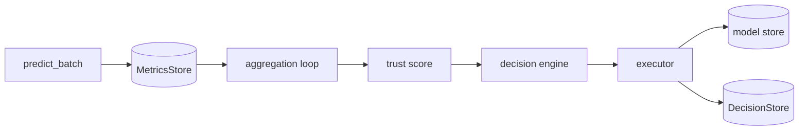

# model-monitor

[](https://github.com/bonnie-mcconnell/model_monitor/actions/workflows/ci.yml)

Production ML monitoring system. Detects feature drift using PSI, tracks performance degradation across rolling windows, and triggers automated lifecycle actions — retraining, rollback, promotion — through a policy engine deliberately kept free of I/O and side effects.

**Two branches:**
- **`main` (this branch)** - classical ML monitoring: PSI drift detection, trust score, automated retraining and rollback. 186 tests.
- [`behavior-monitoring`](https://github.com/bonnie-mcconnell/model_monitor/tree/behavior-monitoring) - everything here plus behavioral contracts for LLM output validation, `ToneConsistencyEvaluator`, `LLMJudgeEvaluator`, and a production ingest API. 320 tests.

---

## Why I built this

Most ML tutorials stop at model training. The harder problem is what happens after deployment: features drift, model quality degrades, and nobody notices until a business metric breaks. I wanted to build the system that catches that — and to understand the engineering decisions that make automated monitoring trustworthy enough to act on.

---

## Quick start

```bash
pip install -e ".[dev]"
make test        # 186 tests, ~17 seconds
make train       # train initial model (required once before sim/run)
make lint        # ruff check src/
make typecheck   # mypy src/model_monitor/
make sim         # drift simulation loop
make run         # FastAPI server at localhost:8000
```

---

## Architecture



The **monitoring layer** records batch-level `MetricRecord`s to SQLite and aggregates them into rolling windows (5m, 1h, 24h). It emits signals only — no decisions are made here. This separation means the monitoring layer cannot accidentally trigger actions.

The **trust score** is a weighted combination of five components bounded to [0, 1]:

| Component | Weight | Source |
|---|---|---|
| Accuracy | 30% | batch accuracy_score |
| F1 | 25% | batch f1_score |
| Confidence | 15% | mean max class probability |
| Drift | 20% | PSI converted to [0, 1] |
| Latency | 10% | decision time in ms |

The **decision engine** is pure policy: no I/O, no persistence, no async code. Priority order: severe drift → reject, catastrophic F1 drop → rollback, sustained degradation → retrain (with cooldown), N stable batches → promote. A pure function means every decision is replayable from stored state and testable with no mocking.

The **executor** handles all side effects asynchronously. SHA-256 fingerprint of the evidence DataFrame provides crash-safe retrain idempotency. An asyncio lock prevents concurrent retrains.

---


## Computational complexity

The monitoring pipeline is designed to add negligible overhead to the inference path.

| Operation | Complexity | Notes |
|---|---|---|
| PSI (single feature) | O(n log n) | histogram over n samples, dominated by sort |
| PSI (multivariate) | O(n·d log n) | averaged across d features independently |
| Trust score | O(1) | five fixed-weight multiplications |
| Aggregation pass | O(w) | w = records in time window; typical w < 10,000 |
| Retrain key (SHA-256) | O(r) | r = rows in evidence buffer |

The aggregation loop runs every 60 seconds in a background asyncio task.
`predict_batch` adds no blocking overhead: drift is computed as a running
histogram update (O(n)), and the trust score is a fixed arithmetic expression.

The behavioral evaluation budget is configurable via `behavioral_budget_ms`
(default 50ms). `scripts/bench_evaluators.py` measures P50/P95/P99 latency
for each evaluator on your hardware before you commit to a budget.

---
## Key design decisions

**PSI not KS test.** PSI is interpretable: below 0.1 is stable, above 0.2 is severe, thresholds are configurable in `config/drift.yaml`. KS gives a p-value, which is harder to threshold deterministically in a policy engine. PSI handles multivariate drift by averaging per-feature scores.

**Reference bin edges stored at training time.** PSI requires applying the same bin edges to both distributions. Recomputing them from production data means comparing incomparable scales. Edges are computed once from training data and stored in `data/reference/reference_stats.json`.

**Baseline F1 written at promotion time.** The decision engine compares current F1 against the baseline in `active.json` - not against a rolling average of recent batches. A rolling baseline drifts with the model, making `f1_drop` approach zero even as absolute performance collapses. This was a real bug: I shipped a version where `f1_baseline=summary.avg_f1`, which made retrain and rollback impossible to trigger from the aggregation path.

**Decision engine has no I/O.** All state is passed as arguments. Given the same inputs, you always get the same decision. Every decision rule is testable with a direct function call and no mocking.

**File-based model store with atomic rename.** `os.replace` maps to `rename(2)` - atomic within a filesystem. There is no state where the model file is partially written. The trade-off: it does not work across processes without a distributed lock, which is acceptable for single-node deployment.

**The test suite found two production bugs:**
- `0.82 - 0.80` in IEEE 754 equals `0.019999...` - less than `0.02`. A candidate whose F1 improves by exactly `min_improvement` was silently rejected. Fixed with an epsilon tolerance in `compare_models`.
- EPS smoothing in `entropy_from_labels` produced a tiny negative value for pure distributions. Shannon entropy is non-negative by definition. Fixed with `max(0.0, ...)`.

---

## What I'd do differently

**Crash recovery for retrains is implemented** via `SnapshotStore` - a write-ahead log that persists the snapshot before execution begins. A crash during retrain leaves a `pending` record; on restart `is_retrain_key_known()` detects it and skips the duplicate. Non-retrain actions (promote, rollback) have no snapshot persistence but are idempotent at the model-store level.

**This branch has no ingest API.** Data enters only through the simulation loop. `POST /metrics/ingest` with API key authentication is implemented in the [`behavior-monitoring`](https://github.com/bonnie-mcconnell/model_monitor/tree/behavior-monitoring) branch.

**Thresholds are hand-tuned.** The trust score weights and PSI thresholds are reasoned defaults, not learned from data. A proper calibration would use historical deployment data.