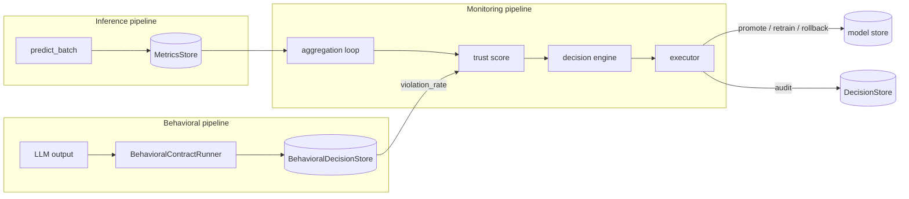

# model-monitor · behavior-monitoring

[](https://github.com/bonnie-mcconnell/model_monitor/actions/workflows/ci.yml)

Production ML monitoring system with behavioral contracts for LLM output validation. Built to understand the engineering decisions that make monitoring actually work - not just track metrics, but detect when a model's behaviour has changed in ways that matter.

**Two branches:**
- [`main`](https://github.com/bonnie-mcconnell/model_monitor/tree/main) - classical ML monitoring: PSI drift detection, trust score, automated retraining and rollback
- **`behavior-monitoring` (this branch)** - everything in main plus behavioral contracts for LLM output validation

---

## Why I built this

Most ML tutorials stop at model training. The harder problem is what happens after deployment: features drift, model quality degrades, and LLM outputs shift in tone or structure without any accuracy metric catching it. I built this to work through the real engineering decisions - not just "monitor the model" but specifically: how do you make automated decisions trustworthy enough to act on, how do you prevent a monitoring system from triggering on noise, and how do you catch behavioral drift that traditional metrics miss entirely?

---

## Quick start

```bash
pip install -e ".[dev]"
make test          # 306 tests, ~23 seconds
make sim           # drift simulation loop
make demo          # behavioral contracts end-to-end demo (downloads ~90MB model on first run)
make run           # FastAPI server at localhost:8000
```

The demo is the fastest way to see the behavioral contracts system working:

```
━━━  model_monitor behavioral contracts demo  ━━━

  ✓  ACCEPT  [good response]
  ✗  BLOCK   [terse response]       ← tone drift detected
  ✗  BLOCK   [missing field]        ← schema violation
  ✗  BLOCK   [not JSON]             ← structural failure
```

---

## Architecture



### Classical monitoring pipeline

The **monitoring layer** records batch-level metrics to SQLite and aggregates them across rolling windows (5m, 1h, 24h). It emits signals only - no decisions are made here. This separation means the monitoring layer cannot accidentally trigger actions.

The **trust score** is a weighted combination of six components bounded to [0, 1]:

| Component | Weight | Source |
|---|---|---|
| Accuracy | 30% (scaled) | batch accuracy_score |
| F1 | 25% (scaled) | batch f1_score |
| Confidence | 15% (scaled) | mean max class probability |
| Drift | 20% (scaled) | PSI converted to [0, 1] |
| Latency | 10% (scaled) | decision time in ms |
| Behavioral | 15% (additive) | contract violation rate |

The behavioral component is additive rather than a post-hoc penalty so its contribution is transparent in `TrustScoreComponents` and auditable in dashboards. The five performance weights scale down proportionally to accommodate it, preserving their relative importance.

The **decision engine** is pure policy: no I/O, no persistence, no async code. Priority order: severe drift → reject, catastrophic F1 drop → rollback, sustained degradation → retrain (with cooldown), N stable batches → promote. Being a pure function makes every decision replayable from stored state.

The **executor** handles all side effects asynchronously. SHA-256 fingerprint of the evidence DataFrame provides crash-safe retrain idempotency. An asyncio lock prevents concurrent retrains.

### Behavioral contracts pipeline

Classical monitoring cannot catch LLM failure modes: tone shifting between versions, structured output breaking after a fine-tune, instruction adherence degrading. These do not show up in accuracy or latency.

Behavioral contracts are explicit, versioned, enforceable guarantees about how a model must behave. A contract is a YAML file:

```yaml
contract_id: support_response_v1
version: "1.0"
scope: customer_support_responses

guarantees:
  - id: valid_json
    description: Every response must be valid JSON
    severity: critical
    evaluator: json_validity

  - id: response_schema_v1
    description: Response must conform to the SupportResponse schema
    severity: critical
    evaluator: json_schema_support_v1

  - id: tone_consistency_v1
    description: Response tone must match reference distribution
    severity: high
    evaluator: tone_consistency_support_v1
```

Four evaluators are implemented:

| Evaluator | Type | Checks |
|---|---|---|
| `JsonValidityEvaluator` | Structural | Output parses as JSON |
| `JsonSchemaEvaluator` | Structural | Output conforms to a JSON Schema bound at construction |
| `ToneConsistencyEvaluator` | Semantic | Cosine similarity between output embedding and centroid of reference embeddings ≥ threshold |
| `LLMJudgeEvaluator` | Semantic (LLM-as-judge) | Structured consistency verdict from an LLM judge; uses injected `LLMClient` Protocol - `MockLLMClient` in tests, `AnthropicLLMClient` in production |

`ToneConsistencyEvaluator` detects when a model update has changed the voice of a system without a deliberate decision to do so. It uses `all-MiniLM-L6-v2` locally - no API key, no network call per evaluation, ~10ms on CPU.

The encoder is injected via a `TextEncoder` Protocol rather than constructed inside the evaluator. This means tests inject a deterministic stub (the full test suite runs in ~10 seconds with no model download) and production can swap encoders without touching the evaluator class.

`BehavioralContractRunner` produces an immutable `DecisionRecord` with full provenance per evaluation: evaluator ID, version, output, outcome, timestamp. `diff_decisions` compares two consecutive records to surface exactly what changed between model versions.

### Ingest API

`POST /metrics/ingest` connects the system to a real inference pipeline. Authenticated via `X-API-Key` header against the `MONITOR_API_KEY` environment variable. Returns 503 if the variable is unset (endpoint administratively disabled), 401 for wrong key, 422 for malformed payload. Metric fields are range-validated - `accuracy` and `f1` must be in [0, 1] so callers cannot silently corrupt the trust score.

```bash
export MONITOR_API_KEY=your-secret-key
curl -s -X POST http://localhost:8000/metrics/ingest \
  -H "Content-Type: application/json" \
  -H "X-API-Key: $MONITOR_API_KEY" \
  -d '{
    "batch_id": "batch_001",
    "n_samples": 512,
    "accuracy": 0.91,
    "f1": 0.89,
    "avg_confidence": 0.84,
    "drift_score": 0.04,
    "decision_latency_ms": 120.0,
    "action": "none",
    "reason": "within thresholds"
  }'
# {"accepted":true,"batch_id":"batch_001","timestamp":1712000000.0}
```

The aggregation loop picks up the record on its next pass (every 60 seconds) and folds it into the rolling trust score and decision pipeline.

---

## Key design decisions

**`AlertCooldownTracker` is a class, not a module-level dict.** The original alerting module used `_last_alert_ts: dict[str, float] = {}` at module scope. This meant two things: tests had to reach into module internals to reset state between runs (`alerting_module._last_alert_ts.clear()`), and any code path that wanted a fresh cooldown context could not get one without monkey-patching. Replacing it with `AlertCooldownTracker` makes the state injectable - tests pass a fresh instance, production uses the process singleton, and the API surface is `reset()` rather than private dict access.

**`DecisionAnalytics` uses `collections.Counter`, not pandas.** The original implementation imported pandas for two operations: `value_counts()` and `tail()`. Both are single lines with the standard library. The analytics layer is called from dashboards and APIs where import weight matters, and pulling in the full pandas dependency for two dict operations was unnecessary. Replaced with `Counter` and a slice.

**PSI not KS test.** The original implementation imported pandas for two operations: `value_counts()` and `tail()`. Both are single lines with the standard library. The analytics layer is called from dashboards and APIs where import weight matters, and pulling in the full pandas dependency for two dict operations was unnecessary. Replaced with `Counter` and a slice. PSI is interpretable: below 0.1 is stable, above 0.2 is severe, thresholds are configurable. KS gives a p-value, which is harder to threshold deterministically in a policy engine. PSI handles multivariate drift by averaging per-feature scores.

**Reference bin edges stored at training time.** PSI requires the same bin edges for both distributions. Computing them from production data each time means comparing incomparable scales. Edges are computed from the reference distribution once, stored in `data/reference/reference_stats.json`, and reused on every production batch.

**Baseline F1 written at promotion time.** The decision engine compares current F1 against the baseline from `active.json` - not against a rolling average of recent batches. A rolling baseline drifts with the model, making `f1_drop` approach zero even as absolute performance collapses. Finding this bug and tracing it to the right fix (store `baseline_f1` in `active.json` at promotion, never update it) is the clearest example of a design decision I had to reason through rather than just write.

**Encoder injection via Protocol.** `ToneConsistencyEvaluator` depends on a `TextEncoder` Protocol, not on `SentenceTransformer` directly. If the encoder were constructed at import time, every `import evaluators` would trigger a 90MB model download - including in CI, in tests, and in any script that imports `JsonValidityEvaluator`. Dependency injection makes the unit fast and the production encoder swappable.

**Decision engine has no I/O.** All state is passed as arguments. Given the same inputs, you always get the same decision. Every decision rule is testable with a direct function call and no mocking.

**Behavioral component is additive, not a post-hoc penalty.** A post-hoc penalty would be opaque - it would change the score without appearing in `TrustScoreComponents`. Making it an explicit component means dashboards and audits show its contribution alongside accuracy and F1. The five performance weights scale down proportionally, preserving their relative importance.

**The test suite found three production bugs:**
- `0.82 - 0.80` in IEEE 754 equals `0.019999...` - less than `0.02`. A candidate whose F1 improves by exactly `min_improvement` was silently rejected. Fixed with an epsilon tolerance in `compare_models`.
- EPS smoothing in `entropy_from_labels` produced a tiny negative value for pure distributions. Shannon entropy is non-negative by definition. Fixed with `max(0.0, ...)`.
- `dashboard.py` used `__dict__` on SQLAlchemy ORM rows, leaking `_sa_instance_state` into API responses. Fixed with `_orm_to_dict()`.
- `RetrainPipeline` evaluated candidate F1 on training data, not held-out data - in-sample estimates favour overfit models. Fixed with a 20% validation split; both models evaluated on the same held-out set.
- `Decision.metadata` was serialised to the audit log on every write but the `metadata_json` column did not exist - context like baseline F1 and threshold values was silently dropped. Fixed by adding `metadata_json TEXT` to `decision_history` and serialising on `record()`.

---

## What I'd do differently

**Crash recovery for retrains is implemented** via `SnapshotStore` - a write-ahead log that persists the retrain key before execution begins. A crash during retrain leaves a `pending` record; on restart `is_retrain_key_known()` detects it and skips the duplicate. `DecisionSnapshot` itself remains in-memory for non-retrain actions (promote, rollback); those are idempotent at the model-store level anyway.

**Model store is single-node.** `os.replace` is atomic within a filesystem but not across processes without a distributed lock. Horizontal scaling would require a different storage backend.

**The behavioral pipeline is wired into the inference path.** `predict_batch` accepts an optional `behavioral_runner` parameter and a `behavioral_output` string. When both are provided, the contract runner evaluates the output within a configurable latency budget (`behavioral_budget_ms`, default 50ms). Evaluations that exceed the budget are logged and skipped - the inference path is never blocked by monitoring failures. The result is available on `last_behavioral_record` for the caller to persist via `BehavioralDecisionStore`.

**Thresholds are hand-tuned.** The trust score weights (0.30 accuracy, 0.25 F1, etc.) and the tone consistency threshold (0.75 by default) are reasoned defaults, not learned values. A proper calibration would use historical data from a real deployment.

---

## Running the tests

```bash
pytest tests/ -v
```

306 tests. No network required. No API keys required. `LLMJudgeEvaluator` tests use a deterministic mock client. No model downloads in the test suite - `ToneConsistencyEvaluator` tests inject a deterministic stub encoder.
