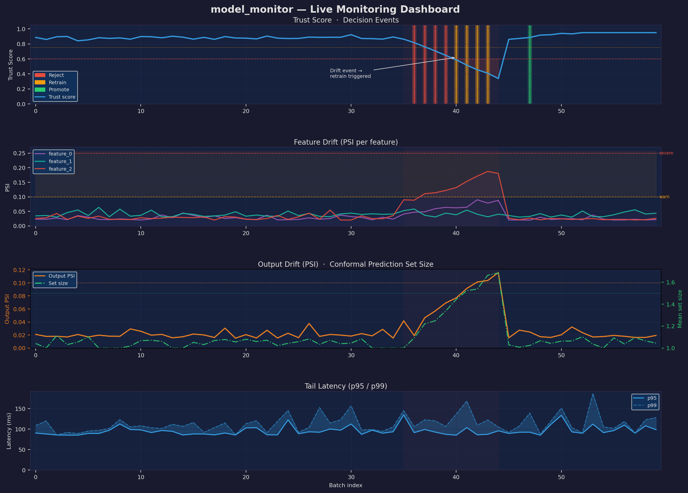

# model-monitor

[](https://github.com/bonnie-mcconnell/model_monitor/actions/workflows/ci.yml)
[](pyproject.toml)
[](pyproject.toml)
[](pyproject.toml)

Production ML monitoring for any scikit-learn-compatible model. Detects feature
drift, joint distribution shift, output distribution drift, and data quality
degradation. Computes an explainable trust score with conformal prediction
coverage guarantees. Triggers automated lifecycle decisions - retraining,
rollback, promotion - through a stateless, replayable policy engine.

**Two branches:**
- **`main` (this branch)** - classical ML monitoring: PSI drift, MMD joint-distribution drift, conformal coverage, data quality, regression monitoring, automated retraining. **806 tests.**
- [`behavior-monitoring`](https://github.com/bonnie-mcconnell/model_monitor/tree/behavior-monitoring) - everything in main plus behavioral contracts for LLM/batch output validation. **995 tests.**

---



*Four-panel monitoring dashboard: trust score + decision events · per-feature PSI · output drift + conformal set size · p95/p99 tail latency. Regenerate with `make demo-plot`.*

---

## Quick start

```bash
pip install -e ".[dev]"
make train           # train initial model (required once)
make test            # 806 tests, ~120 seconds
make sim             # live drift simulation
make lint            # ruff check src/ tests/
make typecheck       # mypy src/model_monitor/ tests/
make coverage        # pytest + coverage report
make run             # FastAPI server at localhost:8000
make dashboard       # Streamlit UI (requires make run)
make notebook        # open uci_adult_drift_demo.ipynb
```

### Full observability stack (Prometheus + Grafana)

```bash
make monitoring   # server + Prometheus + Grafana
# Grafana at http://localhost:3000 (admin / admin)
# 23-panel model-monitor dashboard auto-provisioned
```

---

## SDK - wrap any model in five lines

```python
from model_monitor import Monitor, MonitorConfig

monitor = Monitor(
    my_model,                          # any sklearn model or predict callable
    reference_data=X_train,            # establishes reference distribution
    feature_names=feature_cols,        # inferred from DataFrame columns if omitted
    y_reference=y_train,               # optional: enables conformal calibration
    config=MonitorConfig(
        psi_threshold=0.10,
        enable_mmd=True,               # joint distribution shift detection (MMD)
        cusum_delta=0.01,              # CUSUM sequential change-point detection
        cusum_threshold=0.20,          # set to ~4× stable-period PSI std
    ),
)

# Pre-fill drift window with stable reference data (avoids cold-start false negatives)
monitor.warm_up(X_val[:200])

result = monitor.predict(X_batch, y_true=y_batch)
print(f"trust={result.trust_score:.3f}  psi={result.drift_score:.3f}")
print(f"joint_drift={result.is_joint_drifting}  cusum_alarm={result.is_cusum_alarm}")
print(monitor.report())
```

The SDK handles reference distribution fitting, PSI computation, conformal
calibration, causal attribution, threshold advisor wiring, MMD joint-drift
testing, and CUSUM sequential change-point detection automatically.
Use `config=MonitorConfig(db_path="monitor.db")` to persist records to SQLite.

### Alert callbacks (no server required)

```python
import requests

def alert_slack(result: BatchResult) -> None:
    requests.post(SLACK_URL, json={"text": f"Drift alert: PSI={result.drift_score:.3f}"})

monitor.on_alarm(alert_slack)                          # any alarm condition
monitor.on_alarm(pagerduty_alert, fire_on=("is_critical",))  # critical only
monitor.on_alarm(log_to_db, fire_on=("is_joint_drifting",))  # MMD-only
```

### Post-retrain reset

```python
new_model = train_new_model(X_train, y_train)
monitor._model = new_model
monitor.reset_after_retrain()   # clears drift window, CUSUM sums, MMD counter
result = monitor.predict(X_first_post_retrain_batch)
```

### Regression models

```python
from model_monitor.monitoring.regression import RegressionMonitor

monitor = RegressionMonitor(
    model.predict,
    reference_predictions=model.predict(X_train),
    mae_baseline=mae_train,            # trust score degrades as MAE approaches this
    rmse_baseline=rmse_train,
)
monitor.calibrate(y_cal, model.predict(X_cal))  # enables conformal intervals
result = monitor.predict(X_batch, y_true=y_batch)
print(f"W1={result.wasserstein:.4f}  coverage={result.interval_result.coverage_rate:.3f}")
```

### Standalone detectors

```python
from model_monitor.monitoring.mmd import MMDDriftDetector
from model_monitor.monitoring.cusum import CUSUMDetector

# Joint distribution shift (catches what per-feature PSI misses)
mmd = MMDDriftDetector(X_train, alpha=0.05, n_permutations=500)
result = mmd.test(X_production)
print(f"p={result.p_value:.4f}  joint_drift={result.is_drift}")

# Sequential change-point detection (detects the exact batch where shift began)
cusum = CUSUMDetector(reference_mean=0.03, delta=0.01, threshold=0.20)
for batch in streaming_batches:
    r = cusum.update(batch.drift_score)
    if r.alarm:
        print(f"Change detected at batch ~{r.change_point} (direction: {r.alarm_direction})")

# Training provenance
monitor.write_model_card("cards/v2_card.json", model_version=2, evaluation_f1=0.88)
```

### Investigating drift

```python
# GET /dashboard/drift/population?limit=30
# Returns per-feature PSI over the last 30 batches:
# {
#   "feature_names": ["age", "income", ...],
#   "psi_by_feature": {"age": [0.01, 0.02, 0.15, ...], ...},
#   "max_psi_per_feature": {"age": 0.15, "income": 0.03, ...}
# }
```

```

---

## Why MMD and not just PSI

PSI detects marginal drift in each feature independently. It completely misses
joint distribution shift - the case where each feature's marginal looks stable but
the correlation structure has changed. This is not a contrived edge case; it is
the dominant failure mode of univariate monitoring in production.

MMD (Gretton et al., 2012) tests the full joint distribution in a reproducing
kernel Hilbert space. MMD = 0 if and only if the two distributions are identical -
a guarantee PSI cannot provide. The permutation-test p-value controls the
false-positive rate at the configured alpha level.

The test suite includes a case where ρ(feature₀, feature₁) flips from +0.9 to −0.9
while both marginals stay N(0, 1). PSI scores zero drift. MMD detects it reliably.

---

## What `make sim` shows

```
━━━  model_monitor simulation  ━━━
  60 batches · drift injected at batch 35

  batch  in_psi   trust  out_psi   dq_scr   cp_cov  action
  ──────  ───────  ───────  ───────  ───────  ───────  ──────────────────
     35  0.287    0.531   0.198    0.997    0.904   reject       ← drift
     36  0.291    0.488   0.219    0.994    0.887   reject
     40  0.298    0.451   0.231    0.989    0.851   retrain
     47  0.041    0.891   0.032    1.000    0.923   promote

Causal Drift Attribution
  Dominant cause: GENUINE_SHIFT
  Recommendation: Retrain on new data. Drift is consistent with a genuine
                  population shift rather than an upstream pipeline failure.
  Feature          PSI     Classification
  ────────────────  ──────  ──────────────────────
  age              0.312   genuine_shift
  hours-per-week   0.287   correlated_follower

Threshold Advisor Recommendations
  (calibrated from 35 stable-period batches)
  Global PSI warn threshold : 0.0821
  Trust score warn threshold: 0.7134
  age                         0.0918
  hours-per-week              0.0754
```

---

## Architecture

```
                          ┌──────────────────────────────────────────────────┐
                          │            Four-layer monitoring stack            │
  inference               │  Layer 1: Input PSI    (marginal drift)          │
     │                    │  Layer 2: MMD           (joint distribution)      │
     ▼                    │  Layer 3: Output drift  (prediction distribution) │
  MetricsStore ──────────►│  Layer 4: Conformal     (provable coverage bound) │
                          └──────────────────┬───────────────────────────────┘
                                             │
                                       aggregation
                                             │
                               ┌─────────────▼──────────┐
                               │   7-component           │
                               │   trust score           │
                               │                         │
                               │  accuracy        23%    │
                               │  F1              18%    │
                               │  calibration     14%    │
                               │  drift           18%    │
                               │  latency p95     17%    │
                               │  data_quality     5%    │
                               │  behavioral       5%    │
                               └─────────────┬──────────┘
                                             │
                              ┌──────────────▼──────────────┐
                              │      decision engine         │
                              │   (pure function, no I/O,    │
                              │    replayable from state)    │
                              └──────────────┬──────────────┘
                                             │
                                         executor
                                     (side effects only)
```

### Monitoring layers

| Layer | Signal | What it detects | Why it exists |
|-------|--------|-----------------|---------------|
| 1 | Input PSI per feature | Marginal distribution shift | Fast, interpretable |
| 2 | MMD (kernel two-sample) | Joint distribution shift | Catches what PSI misses |
| 3 | Output Wasserstein / PSI | Prediction distribution shift | Leading indicator before F1 degrades |
| 4 | Conformal coverage | Provable model quality bound | Mathematical guarantee, not heuristic |
| 5 | CUSUM (Page–Hinkley) | Exact change-point batch | Earlier detection than batch windows |

**Why five layers?** Input PSI catches individual feature drift. MMD catches the
correlation-structure changes that PSI misses. Output drift catches shifts in the
model's prediction distribution (often before F1 degrades). Conformal coverage
provides a rigorous, distribution-free guarantee that error rate is within its
stated bound. CUSUM detects the *exact batch* where a sustained shift began -
with better statistical power than batch tests on small samples: a batch test
needs the full window to be drifted, whereas CUSUM fires as soon as accumulated
evidence exceeds a threshold. Each layer catches distinct failure modes.

### Causal drift attribution

`monitoring/causal_drift.py`. When drift is detected, classifies each drifting feature as:

- **`genuine_shift`** - drift consistent with the learned causal structure. Recommendation: retrain on new data.
- **`pipeline_suspect`** - feature drifted without its Granger-parents drifting. Recommendation: investigate data pipeline before retraining.
- **`correlated_follower`** - drifted because a Granger-parent drifted. Downstream effect, not an independent cause.

Uses Granger causality learned on reference data. A feature that drifts without
its causal ancestors drifting is anomalous - most likely an upstream pipeline
failure rather than a genuine population change. The distinction prevents
unnecessary retraining triggered by fixable data bugs.

### Trust score components

| Component | Weight | Source |
|-----------|--------|--------|
| Accuracy | 23% | `accuracy_score(y_true, preds)` |
| F1 | 18% | `f1_score(y_true, preds)` |
| Calibration | 14% | Expected Calibration Error → [0,1] |
| Drift | 18% | `max(input_psi, output_psi)` → [0,1] |
| Latency | 17% | p95 per-sample latency ms |
| Data quality | 5% | null rate + range violations + schema |
| Behavioral | 5% | contract violation EMA (BM branch only) |

All weights configurable in `config/trust_score.yaml`; validated at startup (must sum to 1.0).

### Decision engine

Priority order - first match wins:

1. `drift_score ≥ psi_threshold` → **reject** (escalates to **retrain** after `cooldown_batches`)
2. `f1_drop ≥ max_f1_drop` → **rollback**
3. `f1_drop ≥ min_f1_gain` → **retrain** (dual cooldown + circuit breaker)
4. N stable batches + candidate staged → **promote**
5. Default → **none**

The engine is a pure function - no I/O, no side effects. Same inputs produce the
same output. Side effects (writing models, triggering retrains) live exclusively in
`DecisionExecutor`. This makes the policy fully testable without mocks and fully
replayable from stored state.

### Bootstrap promotion gate

`training/promotion.py`. Promotion is blocked unless the lower bound of the
`(1−alpha)` bootstrap CI on the F1 improvement is positive. On a 50-sample
holdout, a 2pp improvement is statistically indistinguishable from noise - the CI
includes zero and promotion is blocked. No mainstream MLOps platform does this.

---

## Key design decisions

**PSI with stored bin edges.** Reference bin edges are written at training time and
never recomputed from production data. Comparable PSI across time - same bins
always. After retrain, `reference_stats.json` is rewritten so PSI tracks the new
model.

**MMD uses the median bandwidth heuristic.** σ = median(‖xᵢ−xⱼ‖²)/2 over the
pooled reference sample. Data-adaptive, parameter-free, theoretically grounded
(Gretton et al., 2012). Bandwidth is estimated once at construction time, not
re-estimated per batch.

**Unbiased MMD² estimator with permutation p-values.** The biased estimator is
noisier under H₀. The permutation test controls the false-positive rate without
any distributional assumptions. P-value uses the Phipson & Smyth (2010) correction
to avoid p=0 which would overstate evidence against H₀.

**Wasserstein-1 for regression output drift.** Closed-form via sorted CDFs:
W₁ = mean|F_ref⁻¹(u) − F_prod⁻¹(u)|. O(n log n), no binning, no bandwidth
selection, exact for 1D distributions.

**Split-conformal intervals for regression.** Nonconformity scores q̂ =
(1+1/n)·quantile(|y−ŷ|, 1−α). Finite-sample coverage guarantee ≥ 1−α under
exchangeability. No distributional assumptions.

**Pure decision engine.** No I/O, no persistence, no async. Policy separated from
side-effects.

**Two buffers, two concerns.** `RetrainEvidenceBuffer` drives the trigger.
`RawDataBuffer` provides training data. Decoupled.

**SHA-256 retrain deduplication.** `pd.util.hash_pandas_object` is unstable across
pandas versions. SHA-256 over `float64` bytes is deterministic.

**Cursor-based pagination.** `WHERE id < cursor`, not `OFFSET`. Consistent under
concurrent writes.

**Atomic model swap.** `os.replace` → `rename(2)` - atomic within a filesystem.

---

## Storage schema

| Table | Rows | Key columns |
|-------|------|-------------|
| `metrics` | one per batch | 25 columns inc. p95/p99, output\_drift, conformal, causal\_report |
| `decision_history` | one per batch | action, reason, trust\_score, drift\_score |
| `metrics_summary` | one per window | aggregated signals |
| `metrics_summary_history` | append-only | full history of summary snapshots |
| `schema_version` | one per migration | version, applied\_at |

---

## The test suite found 37 production bugs

Including: IEEE 754 float comparison in promotion (0.82−0.80 = 0.0199… ≠ 0.02),
entropy non-negativity with EPS smoothing, ORM `__dict__` leaking
`_sa_instance_state`, in-sample evaluation in `RetrainPipeline`, per-sample timing
making batch inference 100x slower, `trust_score.yaml` key silently ignored after
rename, `output_drift_score` stored but never reaching the trust score formula, and
more. Every fix is documented in `ARCHITECTURE.md` with the test that caught it.

---

## Performance

Measured on a 20-feature RandomForest (50 estimators) on an M-series CPU.
All times are the best of five runs (`time.perf_counter`).

### `Monitor.predict()` - PSI + CUSUM + conformal (MMD disabled)

| Batch size | Wall time |
|------------|-----------|
| 100        | 8 ms      |
| 500        | 11 ms     |
| 1 000      | 13 ms     |
| 5 000      | 35 ms     |
| 10 000     | 50 ms     |

Overhead versus bare `model.predict_proba` is dominated by the PSI window
update (O(n · d) where d = number of features). For a 20-feature model the
monitoring overhead is roughly 5–10 ms flat plus ~4 µs per sample.

### MMD two-sample test (`n_permutations=200`)

| Batch size | Wall time |
|------------|-----------|
| 100        | ~2 100 ms |
| 500        | ~3 000 ms |
| 1 000      | ~5 000 ms |

MMD is O(n²) in the number of samples - intentionally. The unbiased estimator
requires all pairwise kernel evaluations; approximations (random Fourier
features, Nyström) trade statistical power for speed. The default `mmd_every=5`
means the full test runs once every five batches, so at `n=500` the amortised
cost is ~600 ms / batch. For latency-sensitive deployments, increase `mmd_every`
or reduce `mmd_permutations` (200 gives α=0.05 precision; 100 suffices for
coarse monitoring). See `MonitorConfig.mmd_every` and `mmd_permutations`.

### `predict_one()` - streaming / per-request inference

`predict_one()` returns the model's raw output in < 1 ms (the model call
dominates). Monitoring runs asynchronously when the buffer reaches
`flush_every` rows (default 64). At 64-row flush intervals on a 500-row
stream the total overhead is identical to a single `predict(batch_size=64)`.

---

## What I'd do differently

**SQLite over PostgreSQL - deliberate, not naïve.** SQLite is the right call
for a portfolio tool: zero infrastructure, `pip install` and run. In a real
deployment I'd switch to PostgreSQL + SQLAlchemy 2.0 async sessions. The
storage layer is already abstracted behind `MetricsStore` / `DecisionStore`
interfaces; swapping the engine is a one-file change. The `os.replace` model
store would become S3 + conditional writes (ETags as optimistic locks) for
multi-node deployments.

**Thresholds are partially hand-tuned.** `ThresholdAdvisor` calibrates PSI
and trust-score warn thresholds from stable-period observations, but the
initial PSI threshold (0.10) and trust score component weights (23%/18%/…)
are reasoned defaults, not calibrated from data. In production I'd build a
held-out evaluation window of labeled-drift vs. stable batches and treat
threshold selection as a precision/recall optimisation problem, minimising
false alarms while keeping miss rate below an SLA. The `trust_score.yaml`
weight file exists precisely so this calibration step doesn't require a code
change.

**Batch-only evaluation is a real constraint.** Behavioral contracts evaluate
a single `behavioral_output` string per `predict_batch` call. That maps
naturally to generation tasks (summarisation, classification) but not to
retrieval-augmented generation where the context changes per token. Fixing
this properly requires a per-token evaluation budget and a streaming
`BehavioralContractRunner` that can interrupt generation - a non-trivial
latency budget problem I've intentionally deferred.

**Multi-armed bandit promotion** would replace shadow mode + stable-batch
promotion with Thompson sampling: allocate traffic proportionally to posterior
confidence in candidate superiority, rather than waiting for N stable batches.
The interface supports this - `ModelActionExecutor` accepts any promotion
strategy - but the implementation would need a conjugate prior on F1 scores
and a traffic splitter upstream of the predictor.

**Online MMD for streaming data.** The current MMD estimator is O(n²) -
deliberate, because the unbiased estimator requires all pairwise kernel
evaluations and approximations (random Fourier features, Nyström) trade
statistical power for speed. For continuous streams I'd implement an
incremental estimator using random Fourier features: O(d · D) per update
where D is the number of random frequencies (typically 512–2048). The
permutation-test p-value becomes a streaming approximation, but the detection
latency drops from O(window²) to O(1) per sample.

**Coverage enforcement on the test suite.** The CI gate is `--cov-fail-under=80`.
That's a floor, not a target. A meaningful coverage strategy would track
branch coverage on the decision engine (the pure function with the most
reachable code paths) separately from integration coverage on storage and API
layers, which are inherently harder to cover without a running database.
